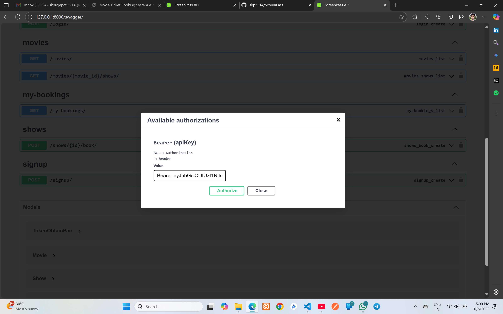

# ScreenPass - Movie Ticket Booking API

A Django REST Framework API for movie ticket booking system with JWT authentication, seat management, and booking operations.

## Features

- 🎬 Movie and show management
- 🎫 Seat booking and cancellation
- 🔐 JWT-based authentication
- 📚 Interactive API documentation (Swagger/ReDoc)
- ✅ Comprehensive test suite

## Tech Stack

- **Backend**: Django 5.2.7, Django REST Framework
- **Authentication**: Simple JWT
- **Database**: SQLite (development)
- **Documentation**: drf-yasg (Swagger/OpenAPI)
- **Testing**: Django Test Framework (Used APITestCase over TestCase)

## Quick Start

### Prerequisites

- Python 3.8+
- pip

### Installation

1. **Clone the repository**
   ```bash
   git clone https://github.com/skp3214/ScreenPass.git
   cd ScreenPass
   ```

2. **Create and activate virtual environment**
   ```bash
   python -m venv .venv
   
   # Windows
   .venv\Scripts\activate
   
   # macOS/Linux
   source .venv/bin/activate
   ```

3. **Install dependencies**
   ```bash
   pip install -r requirements.txt
   ```

4. **Navigate to project directory**
   ```bash
   cd ScreenPass
   ```

5. **Start the development server**
   ```bash
   python manage.py runserver
   ```

`NOTE:` I have already uploaded my sqlite database on the github. So no need to run migrations, just follow the 5 steps to run the project.

The API will be available at `http://127.0.0.1:8000/`

## Credentials
### Superuser credentials to access admin panel
```
username: spsm1818
password: @Sachin3214
```

## API Documentation

### Interactive Documentation
- **Swagger UI**: `http://127.0.0.1:8000/swagger/`


### Authentication

The API uses JWT (JSON Web Tokens) for authentication. Protected endpoints require a Bearer token in the Authorization header.

#### Getting Started with Authentication

1. **Sign up** (create account):
   ```bash
   POST /api/signup/
   Content-Type: application/json
   
   {
     "username": "your_username",
     "email": "your_email@example.com",
     "password": "your_password"
   }
   ```

2. **Login** (get JWT tokens):
   ```bash
   POST /api/login/
   Content-Type: application/json
   
   {
     "username": "your_username",
     "password": "your_password"
   }
   ```
   
   Response:
   ```json
   {
     "access": "eyJ0eXAiOiJKV1QiLCJhbGciOiJIUzI1NiJ9...",
     "refresh": "eyJ0eXAiOiJKV1QiLCJhbGciOiJIUzI1NiJ9..."
   }
   ```

3. **Use the access token** for protected endpoints:
   ```bash
   Authorization: Bearer <access_token>
   ```

### API Endpoints

#### Public Endpoints (No Authentication Required)

| Method | Endpoint | Description |
|--------|----------|-------------|
| POST | `/api/signup/` | Create new user account |
| POST | `/api/login/` | Login and get JWT tokens |
| GET | `/api/movies/` | List all movies |
| GET | `/api/movies/{movie_id}/shows/` | List shows for a specific movie |

#### Protected Endpoints (Authentication Required)

| Method | Endpoint | Description |
|--------|----------|-------------|
| GET | `/api/my-bookings/` | Get current user's bookings |
| POST | `/api/shows/{show_id}/book/` | Book a seat for a show |
| POST | `/api/bookings/{booking_id}/cancel/` | Cancel a booking |
| POST | `/api/token/refresh/` | Refresh access token |

### Example API Usage

#### Using cURL

1. **Sign up**:
   ```bash
   curl -X POST "http://127.0.0.1:8000/api/signup/" \
        -H "Content-Type: application/json" \
        -d '{"username":"testuser","email":"test@example.com","password":"testpass123"}'
   ```

2. **Login**:
   ```bash
   curl -X POST "http://127.0.0.1:8000/api/login/" \
        -H "Content-Type: application/json" \
        -d '{"username":"testuser","password":"testpass123"}'
   ```

3. **Book a seat** (replace `<access_token>` with actual token):
   ```bash
   curl -X POST "http://127.0.0.1:8000/api/shows/1/book/" \
        -H "Content-Type: application/json" \
        -H "Authorization: Bearer <access_token>" \
        -d '{"seat_number":5}'
   ```

### Using Swagger UI

1. Go to `http://127.0.0.1:8000/swagger/`
2. Click "Authorize" button (green lock icon)
3. Enter: `Bearer <your_access_token>`
4. Click "Authorize"
5. Now you can test all endpoints directly in the browser
6. From login endpoint you will get the access token use it in authorize field


## Testing

### Run All Tests
```bash
python manage.py test -v 2
```

### Run Single Test
```bash
python manage.py test MovieAPI.tests.BookingAPITestCase.test_book_seat_success -v 2
```

### Test Coverage
The test suite covers:
- User signup and authentication
- Seat booking (success, double-booking prevention, invalid seats)
- Booking cancellation (own bookings, permission checks)
- My bookings endpoint

## Project Structure

```
ScreenPass/
├── ScreenPass/              # Django project settings
│   ├── settings.py          # Django settings with DRF + JWT config
│   ├── urls.py              # Main URL configuration
│   └── wsgi.py
├── MovieAPI/                # Main application
│   ├── models.py            # Movie, Show, Booking models
│   ├── serializers.py       # DRF serializers
│   ├── views.py             # API views and endpoints
│   ├── tests.py             # Test suite
│   └── urls.py              # App URL patterns
├── manage.py                # Django management script
└── README.md               # This file
```

## Database Models

### Movie
- `title`: CharField (movie name)
- `duration_minutes`: PositiveIntegerField

### Show
- `movie`: ForeignKey to Movie
- `screen_name`: CharField
- `date_time`: DateTimeField
- `total_seats`: PositiveIntegerField

### Booking
- `user`: ForeignKey to User
- `show`: ForeignKey to Show
- `seat_number`: PositiveIntegerField
- `status`: CharField (booked/cancelled)
- `created_at`: DateTimeField (auto)

## Development

### Adding Sample Data

You can add sample movies and shows through the Django admin interface:

1. Go to `http://127.0.0.1:8000/admin/` and use given credentials above.
2. Add movies and shows


### Common Issues

1. **"Authentication credentials were not provided"**
   - Make sure you include the `Authorization: Bearer <token>` header
   - Verify your access token hasn't expired (60-minute lifetime)


